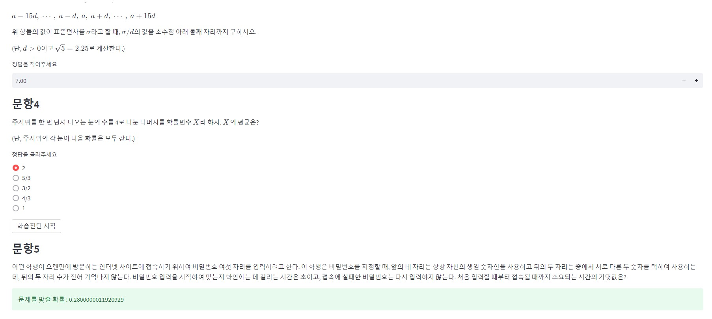

# (2022 AIED) Knowledge Tracing models

## Dataset

Our datasets are synthetic data based on Korean SAT mathematics problem. After labeling the knowledge concepts(based on korean curriculum) for the items, data was generated by conducting simulations based on MIRT-Q model. Datasets were generated based on three criteria. 12 types of dataset can be distinguished through file names. Followings are three criteria  
* Correlation between knowledge concepts (indep/low/high)
* Item sequence (fixe/rand)
* Timestep of item sequence (fixed/rand)  

## T-RKT model

T-RKT model is a minor update version of RKT model from the perspective of the  Korean curriculum. Item embeddings are output of TEMLM language model, which is also learned based on Korean SAT mathematics problem. For a more detailed explanation, check following [github repository](https://github.com/radishtiger/TEMLM_open, "TEMLM link"). T-RKT model structure is shown in the picture below.


## Training model

Model was trained in the Google Colab environment, and each runs were recorded through WandB.  
1. Install packages  
```python
!pip install -r requirements.txt
```
2. Login WandB
```python
import wandb
wandb.login()
```
3. Run(Example)
```
!python3 train.py --model TRKT --dscor low --dsitem fixed --dstime fixed --item 60
```
In order to proceed training, there must be an item config. Set item config 60 if dsitem config is fixed and set 959 if dsitem config is rand. 

## Result
| Correlation | Pretest | DKT | SAKT | RKT |
| :--------: | :--------: |:--------: | :--------: | :--------: |
| indep | fixed | 0.760 |  0.763 | 0.831|
|  | random | 0.666 |  0.766 | 0.769 |
| low | fixed | 0.757 |  0.761 | 0.838|
|  | random | 0.639 |  0.763 | 0.767 |
| high | fixed | 0.761 |  0.7613 | 0.817|
|  | random | 0.657 |  0.760 | 0.765 |

## Application

T-RKT model can be used to evaluate a student's knwledge concept.  
[streamlit demo](https://iss98-2022-aied-kt-app-teckun.streamlit.app/)



## Reference 
* [DKT](https://proceedings.neurips.cc/paper/2015/file/bac9162b47c56fc8a4d2a519803d51b3-Paper.pdf)
* [DKVMN](https://dl.acm.org/doi/pdf/10.1145/3038912.3052580)
* [SAKT](https://arxiv.org/pdf/1907.06837.pdf)
* [RKT](https://dl.acm.org/doi/pdf/10.1145/3340531.3411994)
